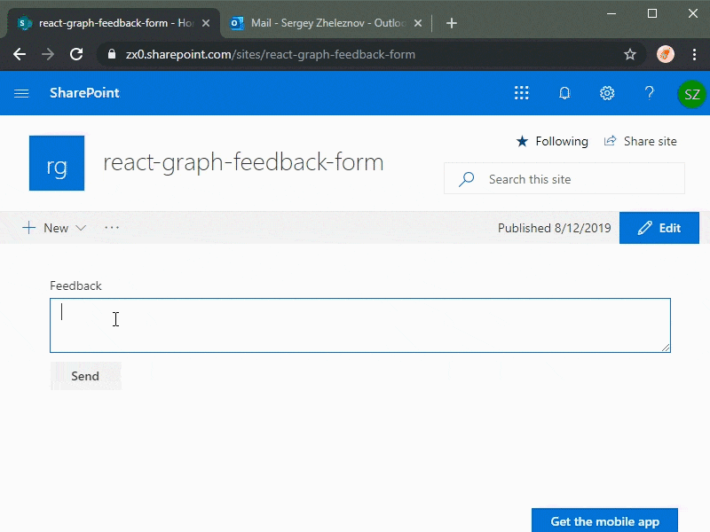

# Feedback Form

## Summary

Sample SPFx React web part which allows sending emails using Microsoft Graph.

## Used SharePoint Framework Version

## Applies to

* [SharePoint Framework](https:/dev.office.com/sharepoint)
* [Office 365 tenant](https://dev.office.com/sharepoint/docs/spfx/set-up-your-development-environment)

## Solution

Solution|Author(s)
--------|---------
react-graph-feedback-form|Sergei Zheleznov (CollabStack)

## Version history

Version|Date|Comments
-------|----|--------
1.0.0|August 12, 2019|Initial release
1.0.3|Dec 15, 2019|Added Logger (@pnp/logging), Added max message length property (PropertyFieldNumber control from spfx-controls-react), Code refactoring, SPFx updated to 1.9.1
1.0.4|May 15, 2020|Upgraded to SPFx 1.10.0 (Hugo Bernier)

## Disclaimer

**THIS CODE IS PROVIDED *AS IS* WITHOUT WARRANTY OF ANY KIND, EITHER EXPRESS OR IMPLIED, INCLUDING ANY IMPLIED WARRANTIES OF FITNESS FOR A PARTICULAR PURPOSE, MERCHANTABILITY, OR NON-INFRINGEMENT.**

---

## Minimal Path to Awesome

* clone this repo
* in the command line run:
  * `npm i`
  * `gulp bundle --ship`
  * `gulp package-solution --ship`
* deploy the package to your app catalog
* approve the API permission request to access e-mails using Microsoft Graph
* add the web part to a page

## Features

This sample illustrates the following concepts:

* using MSGraphClient to communicate with the Microsoft Graph in a SharePoint Framework solution
* requesting API permissions in a SharePoint Framework package
* sending e-mails using Microsoft Graph
* using MSGraphClient in a SharePoint Framework web part
* using @microsoft/microsoft-graph-types
* using @pnp/logging
* using @pnp/spfx-property-controls

