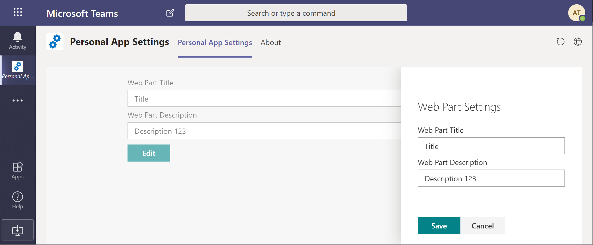

## React Teams Personal App Settings Web Part

Sample web part that demonstrates how you can store Teams Personal App Web Part's properties in user's OneDrive.

## Details

Teams Personal Apps, or Personal Tabs don't have settings.
For SPFx it means few things:
* Web Part will never be switched to **Edit** mode
* Property Pane will never be shown
* `this.properties` value is always `undefined`

But there are definitely scenarios when we want to be able to configure Personal App and store this configuration somehow.
The provided sample demonstrates how it can be achieved using custom Settings Panel and custom list in user's OneDrive.

`OneDriveListWebPartPropertiesService` can be copied from this sample to your web parts and used to implement the same approach.

Downside of this approach is we need to additionally implement "app uninstalled" event to correctly remove properties from OneDrive list.

## Used SharePoint Framework Version 

## Applies to

* [SharePoint Framework](http://dev.office.com/sharepoint/docs/spfx/sharepoint-framework-overview)
* [Office 365 developer tenant](http://dev.office.com/sharepoint/docs/spfx/set-up-your-developer-tenant)

## Solution

Solution|Author(s)
--------|---------
react-teams-personal-app-settings-client-side-solution|[AJIXuMuK](https://github.com/AJIXuMuK)

## Version history

Version|Date|Comments
-------|----|--------
1.0|April 24, 2020|Initial release

## Disclaimer

**THIS CODE IS PROVIDED *AS IS* WITHOUT WARRANTY OF ANY KIND, EITHER EXPRESS OR IMPLIED, INCLUDING ANY IMPLIED WARRANTIES OF FITNESS FOR A PARTICULAR PURPOSE, MERCHANTABILITY, OR NON-INFRINGEMENT.**

## Minimal Path to Awesome
* clone this repo
* move to right folder
* in the command line run:
  * `npm install`
  * `gulp bundle --ship`
  * `gulp package-solution --ship`
* from the `sharepoint/solution` folder, deploy the `.sppkg` file to the App catalog in your tenant
* select deployed package in the App Catalog and click **Sync to Teams** in the Ribbon
* Go to Teams and add **Personal App Settings** personal app

## Features

* Using MS Graph to work with SharePoint lists and list items (create list, create and read list items)
* Using React Hooks for implementing custom components
* Exposing SPFx Web Part as MS Teams Personal App

